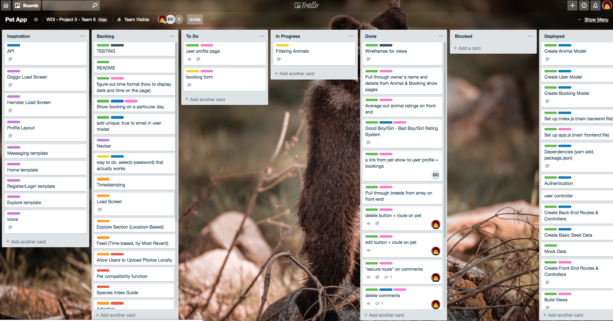

# RuffTrade

#### General Assembly's Web Development Immersive: Project 3

This MEAN application was built in a week, in a two-person team, consisting of [David](https://github.com/davidjcomer) and I, to solidify our knowledge of AngularJS along with token authentication we gained in class at General Assembly.

## Table of Contents
- [Getting Started](#getting-started)
  - [Live app](#live-version-of-the-app)
  - [Installation Instructions](#to-run-locally)
- [Description](#description)
  - [Brief](#brief)
  - [Tools and Technologies Used](#tools-and-technologies-used)
  - [APIs Used](#apis-used)
  - [Wireframes](#wireframes)
  - [Trello](#trello)
  - [Screenshots](#screenshots)
  - [Known Issues](#known-issues)
- [Approach](#approach)
- [Challenges and Wins](#challenges-and-wins)
- [Future Work](#future-work)
- [Contact](#contact)

## Getting Started

#### [Live version of the app](https://ruff-trade.herokuapp.com/#!/)

#### To run locally

Prerequisites: MongoDB installed and `mongod` running

- clone or download repo
- install dependencies in the same directory: `yarn` (or your package manager's equivalent command)
- `yarn start:server`
- `yarn start:client`, and open `http://localhost:8000/` in your browser if it doesn't launch automatically

## Description

RuffTrade is an app where users can arrange to look after other users' pets, similarly to BorrowMyDoggy. Before registering or logging in, users can only view pets' and owners' profiles. When logged in, it is possible to book a particular pet for a specified time period, leave reviews, add pets (as well as edit and delete them), etc.

### Brief

The project's requirements were as follows:

- [x] Use Mongo, Node & Express to build a server-side API
- [x] Your API must have at least 2 related models, one of which should be a user
- [x] Your API should include all RESTFUL actions for at least one of those models
- [x] Include at least one referenced or embedded sub-document
- [x] Include automated tests for at least one resource
- [x] Use Angular to build a front-end that consumes your API
- [x] Use SCSS instead of CSS
- [x] Use Webpack & Yarn to manage your dependencies and compile your source code

### Tools and Technologies Used

| Back End            | Front End           | Other    |
|----------------------|--------------------|----------|
| Node.js (v10.11.0)   | AngularJS (v1.7.1) | Git |
| Express.js (v4.16.3) | JavaScript (ES6) | GitHub |
| MongoDB (v4.0.2)     | HTML5            | Trello |
| Mongoose (v5.3.12)   | CSS3             | Insomnia |
| bcrypt (v3.0.2)      | SCSS             | Heroku |
| JSON Web Token (v2.1.3) | Bulma         |  |
|                      | Moment.js (v2.22.2)  |   |
|                      | Leaflet.js (v1.3.4)  |   |
|                      | Mocha (v5.2.0)   |   |
|                      | Chai (v4.1.2)    |   |

### APIs Used

- OpenStreetMap

### Wireframes

In the planning stage we sketched out a few broad wireframes.

_images coming soon_

### Trello

Our team used a Trello board to keep track of tasks, progress and blockers. It was very useful to know what the other person is currently working on.

### Screenshots

_coming soon_

## Approach

Our instructors divided the class into several groups for this project. It was the first time we worked on the same codebase individually, which also taught us about Git branching, merging and merge conflicts. After a planning session, David and I started the project with pair programming, and then branched off (pun couldn't be helped). I set up the backend routes and controllers, while David started to put together the data for our API. Later on we tried to divide tasks in a way that we're both challenged, and when we couldn't solve a problem we asked each other for help.

## Challenges and Wins

- Figuring out how to use Git in a team took some time, but once it clicked I saw how powerful and useful tool it is. Despite having a few problems and losing a few lines of code it made me a lot more confident at using it.
- Planning in a team is also more difficult than in a solo project. We ended up having to re-plan our model and the way our reviews worked, which was frustrating and took time, but confirmed to me how important it is to think ahead.
- I learned to work with and really appreciate new tools (as mentioned earlier with Git), mainly the REST client Insomnia, which we used to make sure our back end was working properly before moving on to the front end. That helped us avoid some potentially tricky problems!

## Future Work

If I had the time I'd like to add a quicker filter on the Menagerie page, that updates the results as user types. Also having results listed by distance, and showing how far a pet is from a user would be a great addition.

## Contact

Feel free to check out my [Portfolio](http://terezakinnert.com/) with more projects, or [LinkedIn profile](https://www.linkedin.com/in/terezakinnert/).
